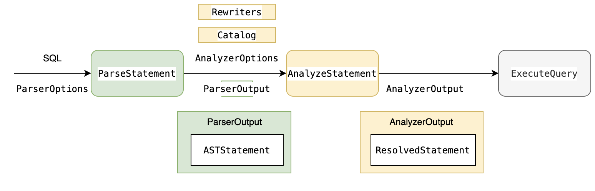

- Start Date:  2021-04-19
- Target Major Version: (0.2.0)
- Reference Issues:  https://github.com/4paradigm/HybridSE/issues/51
- Implementation PR:

# Using ZetaSQL as front-end

# Summary

We are going to use ZetaSQL as our new SQL front-end. The document is trying to figure out:

- **Motivation**: Why we want to refactor the front-end
- **Feasibility**: Whether ZetaSQL is a good option or not
- **Design**: How to integrate ZetaSQL into HybridSE
- **Adoption strategy**: What breaking changes it will bring to FEDB and SparkFE

# Motivation

HybridSE is LLVM-based SQL engine written in C++. It aims at supporting statndare ANSI SQL and some new SQL traits at the same time. However, as a newly engine, HybridSE only supports a limited set of SQL syntaxs currently and its syntax error message is unfriendly. For example, the syntax error message can't tell the location of wrong expression.

ZetaSQL is a SQL Analyzer Framework from Google. We are considering using it as HybridSE's SQL parser and analyzer for following reasons:

- ZetaSQL has been used for BigQuery, Spanner and DataflowSQL by Google
- ZetaSQL is a C++ SQL parser, which can be easily integrate into HybridSE
- ZetaSQL supports standare ANSI SQL and provides clearly error messge. 


# Design

> ZetaSQL defines a language (grammar, types, data model, and semantics) as well as a parser and analyzer. It is not itself a database or query engine. Instead it is intended to be used by multiple engines wanting to provide consistent behavior for all semantic analysis, name resolution, type checking, implicit casting, etc. 
>
> [ZetaSQL Language Guide](https://github.com/google/zetasql/blob/master/docs/README.md)
>
> [ZetaSQL Resolved AST](https://github.com/google/zetasql/blob/master/docs/resolved_ast.md)

## Quick Insight ZetaSQL Parser 

We do some survey on ZetaSQL. ZetaSQL provides many APIs and services. 



The figure above demonstrate the zetasql's analyze workflow. But we **only** use its parser module, since It can fullfill our requirements.

## Do not use ZetaSQL analyzer

We won't use zetasql analyer in this vesion for the following reasons:

- HybridSE already has its statement validation module. We use `SchemaContext` and `ExprPass` to validate column, expression and functions. ZetaSQL analyzer might not meet our need, since it would be difficult to validate our udf and udaf. A lot works will be done with few benefits.
- Analyzer outputs AnalyzerOutput which mainly contains ResolvedStatement. It would be much harder to convert `ResolvedExpression` comparing to convert `ASTExpression`. For instance:
  - `ExprNode` and `ASTExpression` both use `BinaryExpression` to represent operator like `+`, `-`, `*`, `/`, `MOD`, but `ResolvedExpression` use `FunctionCallNode` instead. 
  - `ResolvedExpression` do not have `CastNode`, `CaseWhenNode`
- ZetaSQL can validate SQL statement when we register catalog information to zetasql.  It would be better if we use analyzer after refactor hyrbidse `Catalog`.

## Use ZetaSQL parser

ZetaSQL supports standare ANSI SQL.  We are going to integrate zetasql's parser by following steps:

1. Use `ParseStatement` APIs to generate `ASTStatement` . 
2. Transform `ASTStatement` into `LogicalPlan` .
3. Convert `ASTExpression`  to `ExprNode` 

**Pros**:

We will keep using `ExprNode`  in hybridse. This will introduce least changes into codegen module and physical plan module. Also, keeping the APIs stable would be friendly to out users (e.g. fedb, sparkfe)

**Cons**:

We hava `ExprNode` and `ASTExpression` in hybridse at the same time. This is redundant. 

### Convert `ASTExpression` to `ExprNode`

| ASTExpression                                                | `ExprNode`       | New traits |
| ------------------------------------------------------------ | ---------------- | ---------- |
| ResolvedParameter                                            |                  |            |
| `ASTStringLiteral` <br/>ASTFloatLiteral <br/>ASTNullLiteral <br/>ASTNumericLiteral <br/>ASTIntLiteral <br/>ASTBooleanLiteral | ConstNode        |            |
| ResolvedFunctionCallBase                                     |                  |            |
| ASTCastExpression                                            | CastExprNode     |            |
| ASTCaseValueExpression                                       | CaseWhenExprNode |            |
| ASTFunctionCall                                              | CallExprNode     |            |
| ASTBinaryExpression <br/>ASTAndExpr <br/>                    | BinaryExpr       |            |
| ASTUnaryExpression                                           | UnaryExpr        |            |
| ASTIdentifier                                                | ExprIdNode       |            |
| ASTPathExpression                                            | ColumnRefNode    |            |
| ASTBetweenExpression                                         | BetweenExpr      |            |
| ASTOrderBy                                                   | OrderByNode      |            |
| ASTTablePathExpression                                       | TableRefNode     |            |
|                                                              |                  |            |
|                                                              |                  |            |

 #### Convert `ParserOutput` to LogicalPlan  [WIP]

| ParserOutput / ASTNode                                       | SQLNode         | LogicalPlan                                                  |
| ------------------------------------------------------------ | --------------- | ------------------------------------------------------------ |
| ASTSelect  <br/>ASTSelectList <br/>ASTSelectColumn <br/>ASTFromClause <br/>ASTWhereClause | SelectQueryNode | `bool Planner::CreateSelectQueryPlan(const ASTSelect *root,                                     PlanNode **plan_tree, Status &status) ` |
| ASTInsertStatement                                           | InsertStmt      | `bool Planner::CreateInsertPlan(const node::ASTInsertStatement*,  *root,                                node::PlanNode **output,                                Status &status) {  // NOLINT (runtime/references)` |
| ASTCreateStatement                                           | CreateStmt      |                                                              |
| ASTFunctionDeclaration                                       | FnNodeFnDef     |                                                              |


## Add new syntax into ZetaSQL (WPI)

ZetaSQL also use bison and flex to parse SQL. It will easy for us to imigrate our New SQL syntax, e.g., `LAST JOIN`, `WINDOW ROWS_RANGE`.

### Last Join

```SQL
from_clause_contents:
    table_primary
    | from_clause_contents "," table_primary
      {
        // ...
      }
    | from_clause_contents opt_natural join_type join_hint "JOIN" opt_hint
      table_primary opt_on_or_using_clause_list
      {
        // Give an error if we have a RIGHT or FULL JOIN following a comma
        // join since our left-to-right binding would violate the standard.
        // See (broken link).
        
      }
    //....
    ;
```

`Last Join` can be one of "JOIN" family members. And the `ORDER BY` option can be added into `opt_on_or_using_clause_list` , thus we can introduce `opt_order_by_on_or_using_clause_list` into the `yacc` file.

```SQL
from_clause_contents:
    table_primary
    | from_clause_contents "," table_primary
      {
       //...
      }
    | from_clause_contents opt_natural join_type join_hint "JOIN" opt_hint
      table_primary opt_order_by_on_or_using_clause_list
      { ... }
```


### Window ROWS_RANGE

```SQL
window_specification:
    identifier
      {
        $$ = MAKE_NODE(ASTWindowSpecification, @$, {$1});
      }
    | "(" opt_identifier opt_partition_by_clause opt_order_by_clause
          opt_window_frame_clause ")"
      {
        $$ = MAKE_NODE(ASTWindowSpecification, @$, {$2, $3, $4, $5});
      }
   ;
   
frame_unit:
    "ROWS" { $$ = zetasql::ASTWindowFrame::ROWS; }
    | "RANGE" { $$ = zetasql::ASTWindowFrame::RANGE; }
    ;

opt_window_frame_clause:
    frame_unit "BETWEEN" window_frame_bound "AND for BETWEEN" window_frame_bound
      {
        auto* frame = MAKE_NODE(ASTWindowFrame, @$, {$3, $5});
        frame->set_unit($1);
        $$ = frame;
      }
    | frame_unit window_frame_bound
      {
        auto* frame = MAKE_NODE(ASTWindowFrame, @$, {$2});
        frame->set_unit($1);
        $$ = frame;
      }
    | /* Nothing */ { $$ = nullptr; }
```

the  `ROWS_RANGE` can be add into `frame_unit`.

```code
frame_unit:
    "ROWS" { $$ = zetasql::ASTWindowFrame::ROWS; }
    | "RANGE" { $$ = zetasql::ASTWindowFrame::RANGE; }
    | "RANGE" { $$ = zetasql::ASTWindowFrame::ROWS_RANGE; }
    ;
```


### UDF & UDAF

```SQL
function_call_expression_with_args_prefix:
    function_call_expression_base function_call_argument
      {
        $$ = WithExtraChildren($1, {$2});
      }
    // The first argument may be a "*" instead of an expression. This is valid
    // for COUNT(*), which has no other arguments
    // and ANON_COUNT(*), which has multiple other arguments.
    // The analyzer must validate the "*" is not used with other functions.
    | function_call_expression_base "*"
      {
        auto* star = MAKE_NODE(ASTStar, @2);
        star->set_image("*");
        $$ = WithExtraChildren($1, {star});
      }
    | function_call_expression_with_args_prefix "," function_call_argument
      {
        $$ = WithExtraChildren($1, {$3});
      }
    ;
```

UDF and UDAF are supported as `AST_FUNCTION_CALL` node in `Zetasql` . We don't need to modify `yacc` file. It would be easy to use zetasql implement hybridse's `UDF` and `UDAF`.


### Create SQL 

```SQL
# This is syntax decription from zetasql fro create table statement
create_table_statement:
    "CREATE" opt_or_replace opt_create_scope "TABLE" opt_if_not_exists
    maybe_dashed_path_expression opt_table_element_list
    opt_like_path_expression opt_clone_table
    opt_partition_by_clause_no_hint opt_cluster_by_clause_no_hint
    opt_options_list opt_as_query
      {
        zetasql::ASTCreateStatement* create =
            MAKE_NODE(ASTCreateTableStatement, @$, {$6, $7, $8, $9, $10, $11, $12, $13});
        create->set_is_or_replace($2);
        create->set_scope($3);
        create->set_is_if_not_exists($5);
        $$ = create;
      }
    ;
opt_table_element_list:
    table_element_list
    | /* Nothing */ { $$ = nullptr; }
    ;
table_element:
    table_column_definition
    | table_constraint_definition
    ;

table_constraint_definition:
    "PRIMARY" "KEY" possibly_empty_column_list opt_constraint_enforcement
    opt_options_list
      {
        zetasql::ASTPrimaryKey* node = MAKE_NODE(ASTPrimaryKey, @$, {$3, $5});
        node->set_enforced($4);
        $$ = node;
      }
    | table_constraint_spec
    | identifier identifier table_constraint_spec
      {
        //...
      }
    ;
```

`CREATE` statement in hybridse isn't standard.  So we have to do the following things to adapt to ANSI SQL:

- Expand `table_constraint_definition` to support TIME Index. i.e: 

  - ````SQL
    index(key=(col1, col2), ts=std_ts, ttl= ..., ttl_tyle= ...)
    ````

  - we are considering to support TIME Index follow standare SQL syntax by using `opt_options_list`. i.e:

    - ```SQL
      CREATE TABLE t1 (
      	c1 INT NOT NULL,
        c2 STRING NOT NULL,
        c3 TIMESTAMP NOT NULL,
        KEY(c2) OPTIONS "TS" = c3, "TTL" = 10d, "TTL_TYPE" = "LATEST"
      )
      ```

- Extend `opt_options_list` to support `table_options` of hybridse

  - ```SQL
    table_options:   option
                    {
                        $$ = node_manager->MakeNodeList($1);
                    }
                    | table_options ',' option
                    {
                        $$ = $1;
                        $$->PushBack($3);
                    }
                    | /*EMPTY*/
                    {
                        $$ = NULL;
                    }
                    ;
    
    option:     REPLICANUM EQUALS replica_num
                {
                    $$ = node_manager->MakeReplicaNumNode($3);
                }
                | PARTITIONNUM EQUALS partition_num
                {
                    $$ = node_manager->MakePartitionNumNode($3);
                }
                | DISTRIBUTION '(' distribution_list ')'
                {
                    $$ = node_manager->MakeDistributionsNode($3);
                }
                ;
    ```

  - We are considering to support hybridse's `table_option_list` by using `OPTIONS`

    - ```SQL
      CREATE TABLE t1 (
      	c1 INT NOT NULL,
        c2 STRING NOT NULL,
        c3 TIMESTAMP NOT NULL,
        KEY(c2) OPTIONS "TS" = c3, "TTL" = 10d, "TTL_TYPE" = "LATEST"
      ) OPTIONS REPLICANUM = 3, PARTITIONNUM = 8, LEADER = endpoint1, LEADER = endpoint1, FOLLOWER = endpoint2, FOLLOWER = endpoint3, FOLLOWER = endpoint3;
      ```

  - **We sugguest design distribution options in standare SQL style.** 

  - **We can but do not recommand implement  fedb's `table_options` in zetasql.**


## Design Error Tips

### Syntax Error Tips

#### Use ZetaSQL syntax error tips format

- SELECT list empty

```SQL
select from t
--
ERROR: Syntax error: SELECT list must not be empty [at 1:9]
select  from t
        ^
```

```SQL
select DISTINCT from t
--
ERROR: Syntax error: SELECT list must not be empty [at 1:17]
select DISTINCT from t
                ^
```

- Join 

```SQL
# Error checking: invalid JOIN (not enough ON clause) is detected
select * from a join b join c join d on cond1 on cond2
--
ERROR: Syntax error: The number of join conditions is 2 but the number of joins that require a join condition is 3. INNER JOIN must have an ON or USING clause [at 1:17]
select * from a join b join c join d on cond1 on cond2
                ^
==
```

```SQL
# Error checking: too many ON clauses
select * from a join b on cond1 on cond2
--
ERROR: Syntax error: The number of join conditions is 2 but the number of joins that require a join condition is only 1. Unexpected keyword ON [at 1:33]
select * from a join b on cond1 on cond2
                                ^
==
```

```SQL

select * from a join b on cond1 join c on cond2 on cond3
--
ERROR: Syntax error: The number of join conditions is 2 but the number of joins that require a join condition is only 1. Unexpected keyword ON [at 1:49]
select * from a join b on cond1 join c on cond2 on cond3
                                                ^
==
```

- Create table

```SQL
# Column names must be identifiers.
create table t1 (a.b.c int64);
--
ERROR: Syntax error: Unexpected "." [at 1:19]
create table t1 (a.b.c int64);
                  ^
==
```

```SQL
# Missing type.
create table t1 (a, b string);
--
ERROR: Syntax error: Unexpected "," [at 1:19]
create table t1 (a, b string);
                  ^
==
```

- Drop table

```SQL
drop table;
--
ERROR: Syntax error: Unexpected ";" [at 1:11]
drop table;
          ^
==
```


#### All tips must contain help links

```SQL
select from t
--
ERROR: Syntax error: SELECT list must not be empty [at 1:9]
select  from t
        ^
If the tips above don't help, you can get more help from [slack channel](https://join.slack.com/t/hybridsql-ws/shared_invite/zt-ozu3llie-K~hn9Ss1GZcFW2~K_L5sMg)
```

If the tips above don't help, you can get more help from [slack channel](https://join.slack.com/t/hybridsql-ws/shared_invite/zt-ozu3llie-K~hn9Ss1GZcFW2~K_L5sMg)


### Plan Error Tips

We will discuss plan error tips in the furture works.

## Build Summary

In order to build and test in different sysmtem,  we can simplify build and test packages.  Check [Discussion link](https://github.com/4paradigm/HybridSE/discussions/42) for more details.

### Build and Test zetasql parser

#### Linux

- Build

```
bazel build -- //... -zetasql/jdk/... -zetasql/local_service/... -java/... -javatests/...
```

- Test

```
bazel test --test_summary=detailed  //zetasql/parser/...
```

**Linux system compatibility can be shown as below table:**

| os            | gcc    | glibc | build | test |      |
| ------------- | ------ | ----- | ----- | ---- | ---- |
| centos:7      | 7.3.1  | 2.17  | pass  | pass |      |
| centos:7      | 8.3.1  | 2.17  | pass  | pass |      |
| centos:7      | 9.3.1  | 2.17  | pass  | pass |      |
| centos:8      | 8.3.1  | 2.28  | pass  | pass |      |
| ubuntu:bionic | 8.4.0  | 2.27  | pass  | pass |      |
| ubuntu:focal  | 9.3.0  | 2.31  | pass  | pass |      |
| Debian:buster | 8.31   | 2.28  | pass  | pass |      |
| ArchLinux     | 10.2.0 | 2.33  | pass  | pass |      |

Linux building status: https://github.com/aceforeverd/zetasql/actions/runs/750588862

#### Mac

```
bazel build --features=-supports_dynamic_linker -- //... -zetasql/jdk/... -zetasql/local_service/... -java/... -javatests/...
```

- Test

```
bazel test --test_summary=detailed --features=-supports_dynamic_linker //zetasql/parser/...
```

**Mac system compatibility can be shown as below table:**

| os        | Clang                                           | build | test |      |
| --------- | ----------------------------------------------- | ----- | ---- | ---- |
| Mac:10.15 | Apple clang version 12.0.0 (clang-1200.0.32.21) | pass  | Pass |      |

Mac building status: https://github.com/jingchen2222/zetasql/runs/2348401484?check_suite_focus=true

### Build and Test Problems

- absl

```
executing command external/local_config_cc/cc_wrapper.sh -lc++ -fobjc-link-runtime -Wl,-S -shared -o bazel-out/darwin-fastbuild/bin/external/com_google_absl/absl/synchronization/libsynchronization.so ... (remaining 13 argument(s) skipped)
```

[abseil/abseil-cpp#848](https://github.com/abseil/abseil-cpp/issues/848)
[abseil/abseil-cpp#848 (comment)](https://github.com/abseil/abseil-cpp/issues/848#issuecomment-761091854)
Workaround by using `--features=-supports_dynamic_linker`

- grpc

```
external/upb/upb/upb.h:39:3: error: '_Bool' is a C99 extension [-Werror,-Wc99-extensions]
```

See workaround here [jingchen2222/zetasql@`cf05607`#diff-a70ff1813d701c83652081d186aba748e180da906b69ec3b86e8d6383530d5e2](https://github.com/jingchen2222/zetasql/commit/cf05607f126a2d28ff25778b345ea1406650e94c#diff-a70ff1813d701c83652081d186aba748e180da906b69ec3b86e8d6383530d5e2)

- bazel test //zetasql/parser/...

```
FAIL: //zetasql/parser:parser_create_table_test (see /private/var/tmp/_bazel_runner/407c56d6e0400a81316224b3e40aaea4/execroot/com_google_zetasql/bazel-out/darwin-fastbuild/testlogs/zetasql/parser/parser_create_table_test/test.log)
FAIL: //zetasql/parser:parser_standalone_type_test (see /private/var/tmp/_bazel_runner/407c56d6e0400a81316224b3e40aaea4/execroot/com_google_zetasql/bazel-out/darwin-fastbuild/testlogs/zetasql/parser/parser_standalone_type_test/test.log)
```

See workaround here:
https://github.com/jingchen2222/zetasql/pull/3/files#diff-7ebc691e7f3f59ec4bc1719cb502fda627d8dcb1c4bbd4e2bc62370bcacaf6f1
file: zetasql/parser/builddefs.bzl


### Use Zetasql as cmake dependency

Although zetasql is a bazel-based project and have its dependencies in the mean time, We'll use zetasql in a cmake proeject as following steps (Checkout [zetasql-sample](https://github.com/aceforeverd/zetasql-sample) to see the details.): 

- Prepare headers
  -  find every header file and install to a include directory
    after telling cmake how to find zetasql's lib and include headers, it should link.
- compiled shared library (.so) or static library (.a)
  - find and install compiled .so/.a into same directory (without directory hierarchy)
  - for static library, using tools like `ar` or `libtool` to merge into single static archive

**Exceptions**
bazel's `cc_library` should produce both .a and .so by default. But a lib called `template_sql_tvf` do not follow this, it is built with `likestatic=True` in bazel's `cc_library`. Look like a implementation limit.

**Transitive dependence**

zetasql's thirdparty dependencies, should merge into HybridSQL's standard dependency list. Some may have breaking upgrade:

1. protobuf: form 2.x.x -> 3.x.x

**Compiler and Options**

zetasql is built with c++1z(c++17), since c++17 is stabilized in gcc 8 (not sure which specific version but 8.3 works fine), we should upgrade to gcc 8 or later. And use `-std=c++1z` as well because zetasql's include file use c++17 features.

checkout this for more: https://stackoverflow.com/questions/46746878/is-it-safe-to-link-c17-c14-and-c11-objects

### Update thirdpaty

- Maintain 4paradigm/zetasql 
- Update thirdparty libraries and development dockers
  - adding zetasql and its dependencies into thirdparty
- Update thirdparty install guide


# Adoption strategy

If we implement this proposal, it might bring some changes of APIs which is used by SparkFE and FEDB.

We will try to avoid introducing many changes, but there are still some changes:

- In order to use zetasql, we might have to upgrade the OS and dependencies libraries. For example, `protobuf` upgrade from 2.x.x to 3.x.x. 
- We will use standare SQL which might have conflict with hybridse original SQL syntax. For Instance,  `CREATE TABLE` Statement, `Index` and `Partition` options.


