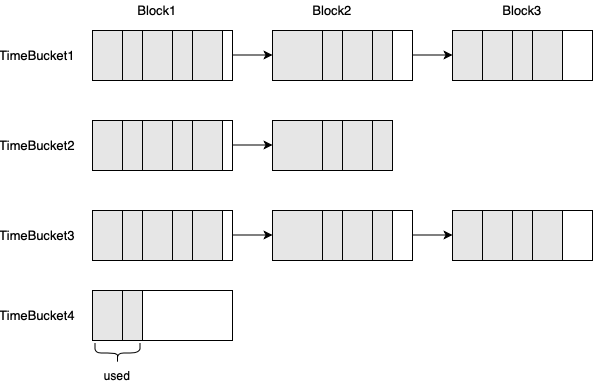

- Start Date: 2021-06-24
- Target Major Version: (2.4.0)
- Reference Issues: 
- Implementation PR: 

# Memory Pool

# Summary
OpenMLDB use [TCMalloc](https://github.com/gperftools/gperftools) as memory alloction lib currently. Like other mallocs, the heap managed by TCMalloc consists of a set of pages. A run of contiguous pages is represented by a Span object. A span can either be allocated, or free. But if only a small buffer in a span is not freed, this span can not release to os which is called memory fragment. The memory is already located in central free list when a partition in OpenMLDB is dropped.

So We try to design a novel memory pool to avoid this problem.

# Detailed Design

When insert one record to OpenMLDB, it will call multiple alloctions and construct structs/classes as follows: 
| data structure | size | description
| --- | --- | --- |
| key | key length | 
| value | value length | 
| DataBlock | 16 |
| KeyEntry | 40 | 
| Node<Slice, void*>| 40 |
| Node<uint64_t, void*>| 32 | 
| std::atomic<Node<Slice, std::string*>*> node0[12] | 96 | 8 * height

By analyzing the above data structure, we found that the memory alloction has the following situations and we can use different alloction strategy.

| - | - | struct / class | alloction strategy |
| --- | --- | --- | --- |
| Normal | Fixed length | KeyEntry | boost::pool
| Normal | Variable length| Key | Tcmalloc/Var-length pool
| Timeserise | Fixed length | Node | TimeSerisePool
| Timeserise | Variable length | Value | TimeSerisePool


TimeSerisePool is composed of multiple TimeBuckets as followers. 

<div align=center></div>

```C++
class TimeBucket {
  public:
    struct Block {
        Block* next;
        char data[]; 	    
    };
    Clear(); // free the block list
    void* Alloc(uint32_t size) {
        object_num_++;    
        if (current_offset_ + size <= block_size_ - sizeof(Block)) {
            void* addr = head_->data + current_offset_;
            current_offset_ += size;
            return addr;
        } else {
            Block* block = (Block*)malloc(block_size_);
            current_offset_ = size;
            block->next = head_->next;
            head_ = block;
            return head_->data;
        }
    }
  private:
    uint32_t block_size_;
    uint32_t current_offset_;
    uint32_t object_num_;
    Block* head_;  
};
```

```C++
class TimeSerisePool {
  public:
    Alloc(uint32_t size, uint64_t time);
    Free(void*, uint64_t time);
  private:
    // key is the time / (60 * 60 * 1000)
    std::map<uint32_t, std::unique_ptr<TimeBucket>> pool_;
};
```

Note: TimeSerisePool does not guarantee thread safety.

# Adoption stratege
If we implement this proposal, there is no impact on existing interfaces